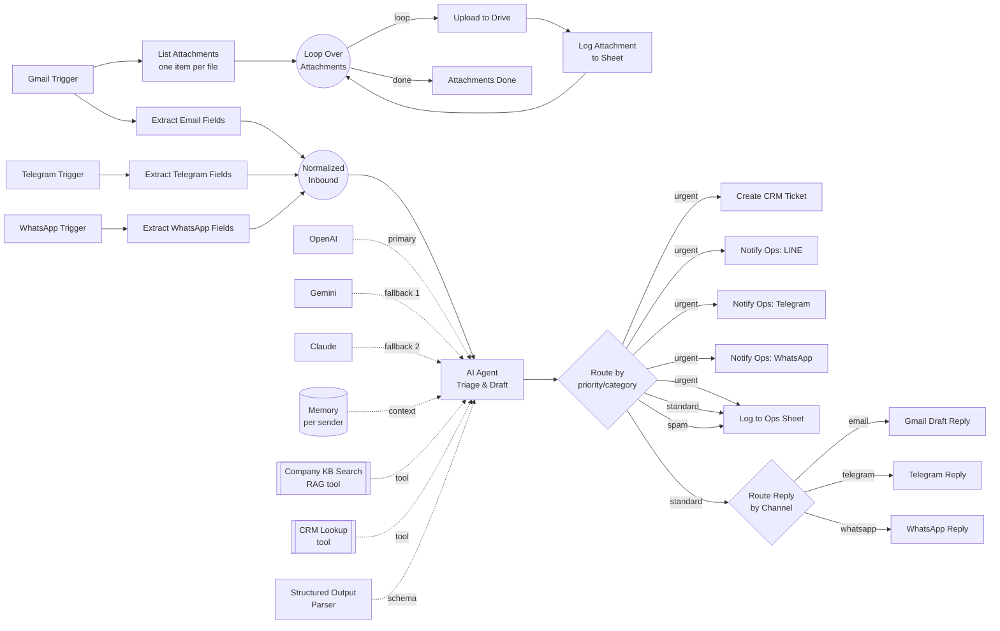

# Agentic Email Triage & Ops Automation (n8n)

A reference n8n workflow for a common services-business need: a shared inbox
(now spanning email, Telegram, and WhatsApp) gets messages that need to be
**read, classified, logged, and either answered or escalated** — without a
human manually triaging every message.

This repo is a portfolio piece: an importable `workflow.json` plus the
reasoning behind the design, not a specific client's production system.

## Architecture



## What it does

```
Gmail / Telegram / WhatsApp (new message on any channel)
   → each channel has its own Extract-Fields node that maps the raw
     payload to a common shape (from, subject, body, messageId, channel,
     replyTarget) and feeds it into Normalized Inbound — a single junction
     node downstream logic references regardless of which channel fired
   → (Gmail only, in parallel) List Attachments fans out one n8n item per
     attachment, then Loop Over Attachments processes them one at a time:
     upload to Drive → append a row to the "Attachments" sheet tab → next
     attachment, until none remain
   → AI Agent (multi-provider LLM + memory + RAG tool + CRM tool)
       - classifies category (billing / technical / sales / complaint / spam)
       - classifies priority (urgent / standard)
       - looks up the sender in the CRM before responding
       - searches the internal knowledge base (RAG) to ground any factual answer
       - drafts a reply ONLY for standard-priority messages, matching tone/
         length to the channel (short for Telegram/WhatsApp, longer OK for email)
   → route by priority/category:
       urgent   → CRM ticket created + ops pinged on LINE + Telegram + WhatsApp + logged to Sheet
       standard → Route Reply by Channel sends the draft back on the same
                  channel the message came in on (Gmail draft / Telegram
                  message / WhatsApp message) + logged to Sheet
       spam     → logged to Sheet only
```

**Multi-provider AI, not one hardcoded model.** The AI Agent's language-model
input has three chat models connected — OpenAI (`gpt-4o-mini`), Google
Gemini (`gemini-1.5-flash`), and Anthropic Claude (`claude-3-5-sonnet-latest`)
— tried in that order with automatic failover if one errors or hits a rate
limit. This is a **fallback chain**, not round-robin rotation: n8n workflows
are a static graph, so spreading load evenly across providers on every
request would need an external counter (e.g. a small KV store) to decide
which model goes first each time. Fallback-on-failure gets you the
reliability win with none of that extra infrastructure; add true rotation
later if cost-balancing across providers becomes the priority.

**Why attachment links live in a separate sheet tab, not a column on the main
log row:** the main row (Log to Ops Sheet) is written from a single AI Agent
call, while the attachment branch runs a variable number of loop iterations
(zero to many, Gmail only). Waiting for both branches to finish before
writing one row would mean the ops log is only as fast as the slowest
attachment upload, and any failed upload would block the whole row. Instead,
each attachment gets its own row in an `Attachments` tab (`messageId`,
`subject`, `fileName`, `driveLink`), correlated back to the main log by
`messageId`.

## Why it's built this way

- **Memory is per-sender, not global.** The conversation memory node keys on
  the sender's email address, so if the same customer emails again next
  week, the agent has that thread's context — without leaking one
  customer's history into another's.
- **RAG before answering, not instead of a human for hard cases.** The KB
  search tool is there so the agent grounds factual claims (pricing, policy)
  in real documents instead of guessing. But the system prompt explicitly
  tells the agent to **not** draft a reply at all for urgent/escalation
  cases — it flags `needs_human: true` and leaves `suggested_reply` empty.
  That boundary is deliberate: agentic automation should speed up the easy
  80%, not auto-send responses to an angry customer or a payment failure.
- **Structured output, not free text.** The agent is forced through a JSON
  schema (category/priority/summary/suggested_reply/needs_human) so
  downstream nodes (Sheets, CRM, LINE) can route deterministically instead
  of parsing prose.
- **One workflow, three integration surfaces.** Gmail (source + draft
  output), Google Sheets (audit log), and two outbound HTTP calls (a
  generic CRM ticket API + LINE's push-message API) — showing the same
  agent pattern extends to whatever channel/CRM a real client already uses.

## Tech stack

| Layer | Tool / Pattern |
|---|---|
| Orchestration | n8n (self-hosted), `@n8n/n8n-nodes-langchain` |
| LLM | OpenAI `gpt-4o-mini` → Gemini `gemini-1.5-flash` → Claude `claude-3-5-sonnet-latest` fallback chain |
| Memory | LangChain buffer-window memory, keyed per sender |
| Retrieval (RAG) | Qdrant vector store + OpenAI embeddings (`text-embedding-3-small`) |
| Structured output | LangChain JSON-schema output parser |
| Integrations | Gmail API, Telegram Bot API, WhatsApp Cloud API, Google Drive API, Google Sheets API, generic REST (CRM), LINE Messaging API |
| Attachment handling | Code node fans out N attachments → SplitInBatches loop (1 at a time) → Drive upload → Sheets append (Gmail only) |
| Safety pattern | Prompt-level escalation carve-out (no auto-send on urgent/ambiguous cases) |

## Files

- `workflow.json` — importable n8n workflow (Settings → Import from File).
  Replace the `REPLACE_ME` / `REPLACE_WITH_SHEET_ID` placeholders with real
  credentials before running.
- `PROCESS.md` — the design notes: prompt structure, why this memory/RAG
  setup, what was tested, and how a non-technical team could take over
  monitoring it day to day.
- `TEST_CASES.md` — the representative test emails used to validate the
  classification/escalation logic before wiring the workflow live.
- `kb/` — sample knowledge-base documents used to demonstrate the RAG tool
  (`search_company_kb`). Swap these for a real company's docs in production.

## Requirements to run

- n8n (self-hosted or cloud) with the LangChain nodes enabled
  (`@n8n/n8n-nodes-langchain`)
- An OpenAI credential, a Google Gemini (PaLM API) credential, and an
  Anthropic credential — all three are wired into the AI Agent's fallback
  chain; if you only want one or two providers, delete the unused chat
  model node(s) and their connection
- Gmail OAuth2 credential with send + draft scopes
- A Telegram Bot API token (`telegramApi` credential) — used for both
  inbound triage and outbound ops alerts/replies
- A WhatsApp Business Cloud API credential (`whatsAppTriggerApi` for the
  trigger, `whatsAppApi` for sending) — same dual inbound/outbound use
- Google Drive OAuth2 credential (used to upload email attachments; set
  `folderId` in the "Upload Attachment to Drive" node to a real Drive folder)
- Google Sheets OAuth2 credential (the target spreadsheet needs both a
  `Log` tab and an `Attachments` tab — see above)
- A vector store (Qdrant used here; swappable for Pinecone/Supabase/etc.)
- Generic HTTP header auth credentials for your CRM and LINE channel token
- Two environment variables for ops-alert routing: `TELEGRAM_OPS_CHAT_ID`
  and `WHATSAPP_OPS_NUMBER` (alongside the existing `LINE_OPS_GROUP_ID` and
  `CRM_WORKER_BASE_URL`)

## License

MIT — see `LICENSE`.
