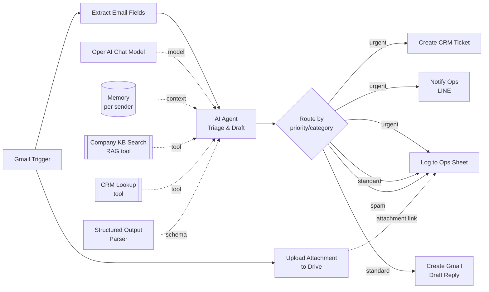

# Agentic Email Triage & Ops Automation (n8n)

A reference n8n workflow for a common services-business need: a shared inbox
gets emails that need to be **read, classified, logged, and either answered
or escalated** — without a human manually triaging every message.

This repo is a portfolio piece: an importable `workflow.json` plus the
reasoning behind the design, not a specific client's production system.

## Architecture



## What it does

```
Gmail (new email)
   → extract sender/subject/body
   → (in parallel) any attachment is uploaded to a Drive folder;
     the resulting webViewLink is carried through to the Sheet log
   → AI Agent (LLM + memory + RAG tool + CRM tool)
       - classifies category (billing / technical / sales / complaint / spam)
       - classifies priority (urgent / standard)
       - looks up the sender in the CRM before responding
       - searches the internal knowledge base (RAG) to ground any factual answer
       - drafts a reply ONLY for standard-priority messages
   → route by priority/category:
       urgent   → CRM ticket created + ops team pinged on LINE + logged to Sheet
       standard → Gmail draft reply created + logged to Sheet
       spam     → logged to Sheet only
```

## Why it's built this way

- **Memory is per-sender, not global.** The conversation memory node keys on
  the sender's email address, so if the same customer emails again next
  week, the agent has that thread's context — without leaking one
  customer's history into another's.
- **RAG before answering, not instead of a human for hard cases.** The KB
  search tool is there so the agent grounds factual claims (pricing, policy)
  in real documents instead of guessing. But the system prompt explicitly
  tells the agent to **not** draft a reply at all for urgent/escalation
  cases — it flags `needs_human: true` and leaves `suggested_reply` empty.
  That boundary is deliberate: agentic automation should speed up the easy
  80%, not auto-send responses to an angry customer or a payment failure.
- **Structured output, not free text.** The agent is forced through a JSON
  schema (category/priority/summary/suggested_reply/needs_human) so
  downstream nodes (Sheets, CRM, LINE) can route deterministically instead
  of parsing prose.
- **One workflow, three integration surfaces.** Gmail (source + draft
  output), Google Sheets (audit log), and two outbound HTTP calls (a
  generic CRM ticket API + LINE's push-message API) — showing the same
  agent pattern extends to whatever channel/CRM a real client already uses.

## Tech stack

| Layer | Tool / Pattern |
|---|---|
| Orchestration | n8n (self-hosted), `@n8n/n8n-nodes-langchain` |
| LLM | OpenAI `gpt-4o-mini` (swappable) |
| Memory | LangChain buffer-window memory, keyed per sender |
| Retrieval (RAG) | Qdrant vector store + OpenAI embeddings (`text-embedding-3-small`) |
| Structured output | LangChain JSON-schema output parser |
| Integrations | Gmail API, Google Drive API, Google Sheets API, generic REST (CRM), LINE Messaging API |
| Safety pattern | Prompt-level escalation carve-out (no auto-send on urgent/ambiguous cases) |

## Files

- `workflow.json` — importable n8n workflow (Settings → Import from File).
  Replace the `REPLACE_ME` / `REPLACE_WITH_SHEET_ID` placeholders with real
  credentials before running.
- `PROCESS.md` — the design notes: prompt structure, why this memory/RAG
  setup, what was tested, and how a non-technical team could take over
  monitoring it day to day.
- `TEST_CASES.md` — the representative test emails used to validate the
  classification/escalation logic before wiring the workflow live.
- `kb/` — sample knowledge-base documents used to demonstrate the RAG tool
  (`search_company_kb`). Swap these for a real company's docs in production.

## Requirements to run

- n8n (self-hosted or cloud) with the LangChain nodes enabled
  (`@n8n/n8n-nodes-langchain`)
- An OpenAI (or swap for any other LLM) credential
- Gmail OAuth2 credential with send + draft scopes
- Google Drive OAuth2 credential (used to upload email attachments; set
  `folderId` in the "Upload Attachment to Drive" node to a real Drive folder)
- Google Sheets OAuth2 credential
- A vector store (Qdrant used here; swappable for Pinecone/Supabase/etc.)
- Generic HTTP header auth credentials for your CRM and LINE channel token

## License

MIT — see `LICENSE`.
